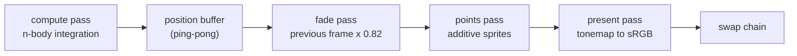

# GPU N-Body

Real-time gravitational N-body simulation running entirely on the GPU through raw WebGPU compute
shaders. **32,768 bodies at 60 fps — over 82 billion pair-force evaluations per second — in a
browser tab**, with no engine, no framework, and no third-party rendering library. That is 47.7×
faster than the same algorithm on the CPU.

Zero runtime dependencies; the whole thing ships in **13.7 kB gzipped**.

**[▶ Live demo](#)** &nbsp;·&nbsp; no install, no clone, just open it

<!-- TODO: demo.gif -->


---

## What it does

Every body attracts every other body, so a single step costs O(n²) force evaluations. The same
physics is implemented three ways so you can switch solvers live and watch the cost change:

| Solver | Algorithm | Where it runs |
| --- | --- | --- |
| **GPU tiled** | Direct summation, O(n²) | WGSL compute shader with workgroup shared memory |
| **CPU Barnes-Hut** | Octree approximation, O(n log n) | Single-threaded TypeScript |
| **CPU naive** | Direct summation, O(n²) | Single-threaded TypeScript |

Four scenarios: a bulge-dominated spiral disk, a two-galaxy collision, a cold-collapse sphere that
free-falls and violently relaxes, and a solar system with asteroid and Kuiper belts.

## Performance

Measured on an **Apple M4 (8-core GPU), Chrome**, via the in-app `benchmark` button. All three
solvers run identical initial conditions at 4,096 bodies so the comparison is apples to apples.

| Solver | Bodies | ms / step | Speedup | Pair-forces / s |
| --- | ---: | ---: | ---: | ---: |
| CPU naive | 4,096 | 24.07 | 1.0× | 0.70 G |
| CPU Barnes-Hut (θ=0.75) | 4,096 | 6.93 | 3.5× | 2.42 G |
| **GPU tiled** | 4,096 | **0.505** | **47.7×** | **33.2 G** |
| **GPU tiled** | 32,768 | **13.06** | — | **82.2 G** |

The two speedups come from completely different places, which is the interesting part:

- **Barnes-Hut wins by doing less work.** At 32,768 bodies it evaluates ~1.3% of the pairs a direct
  solver would, by collapsing distant clusters into a single centre of mass.
- **The GPU wins by doing the same work faster.** It still evaluates every one of the 1.07 billion
  pairs per step at 32,768 bodies — it is 47.7× faster than the CPU on byte-for-byte identical work.

Note that the GPU is *more* efficient at the larger problem size: 33.2 G pair-forces/s at 4,096
bodies versus 82.2 G at 32,768. At 4,096 bodies there is not enough parallel work to saturate all
8 GPU cores, so per-dispatch overhead dominates. Scaling up is nearly free until the device is
actually busy.

## How it works

### The tiled compute kernel

The naive GPU kernel is one thread per body reading all n positions from global memory: n² global
reads per step, which is memory-bound long before it is compute-bound.

Instead, each 64-thread workgroup cooperatively stages a 64-body tile into on-chip
`var<workgroup>` memory, synchronizes, and then every thread in the group reuses that tile from
fast local storage:

```wgsl
for (var t = 0u; t < tileCount; t = t + 1u) {
  tile[lid.x] = select(vec4f(0.0), posIn[t * TILE + lid.x], src < params.count);
  workgroupBarrier();

  for (var k = 0u; k < TILE; k = k + 1u) {
    let d = tile[k].xyz - selfPos;
    let dist2 = dot(d, d) + params.softening2;
    let invDist = inverseSqrt(dist2);
    acc += d * (tile[k].w * invDist * invDist * invDist);
  }
  workgroupBarrier();
}
```

Global memory traffic drops from n² to n²/64 while the arithmetic stays identical. This is the same
structure as NVIDIA's classic CUDA N-body sample, expressed in WGSL.

Positions are **double-buffered**: a thread reads every body's current position while writing only
its own, so reading and writing one buffer would be a data race. Velocities are touched only by
their owning thread, so a single velocity buffer is safe.

Threads past the end of the body list cannot return early, because `workgroupBarrier()` must be
reached in uniform control flow. They do harmless duplicate work and skip the final write instead.

### The render path

Simulation data never round-trips through the CPU — the vertex shader reads the same storage
buffers the compute pass just wrote.



WebGPU has no `gl_PointSize`, so each body is a two-triangle billboard expanded in clip space,
sized per-pixel with a perspective-correct radius. Sprites blend purely additively with a soft
radial falloff, so overlapping bodies accumulate into HDR density — which means **no depth buffer
and no back-to-front sorting**, because addition is order independent.

Motion trails come from ping-ponging two `rgba16float` targets: the fade pass copies the previous
frame scaled by a persistence factor, the points pass adds the current bodies on top, and a
geometric decay per frame produces the exponential comet tails.

### The Barnes-Hut octree

Bodies are bucketed into an octree rebuilt every step. When computing the force on a body, any node
whose angular size `width / distance` falls below θ is collapsed to its centre of mass rather than
opened. θ = 0 degenerates to direct summation; larger θ approximates more aggressively.

The tree lives in flat typed arrays with bodies threaded through leaves as an intrusive linked
list, so a step allocates nothing once the arrays are warm. Centres of mass are computed in a
single reverse-index pass, which works because children are always allocated after their parent.

## Numerical choices

**Plummer softening.** Forces use `1 / (r² + ε²)^{3/2}` rather than `1 / r²`. Without it, two bodies
passing close produce near-infinite acceleration and get slingshotted out of the simulation.

**Semi-implicit (symplectic) Euler.** Velocity is updated first, then position using the already
updated velocity. It costs the same as explicit Euler but conserves energy far better over long
orbital integrations.

**Initial conditions matter more than the integrator.** Disk bodies are seeded on circular orbits
derived from the *softened* potential, `v² = G·m·r² / (r² + ε²)^{3/2}`. Seeding with the textbook
`v = √(GM/r)` instead diverges near the core and ejects bodies on the first step — in this project
that bug sent bodies to a radius of 29,000 in a galaxy only 48 units across.

The disk is also deliberately bulge-dominated and given ~15% velocity dispersion. A cold,
self-gravity-dominated disk is Toomre-unstable and fragments into discrete clumps rather than
holding a smooth shearing spiral.

## Verifying it

Headless browsers cannot reliably capture a WebGPU surface — during development, a canvas cleared
to pure red read back as `(0,0,0,0)`, making every screenshot a false negative. So correctness is
checked by pulling data back *through the GPU* instead of trusting an image.

In dev, `await window.__nbody()` reports:

```js
{
  bodies: 32768,
  finiteFraction: 1,          // no NaNs escaped the integrator
  onScreenFraction: 0.76,     // bodies actually inside the view frustum
  radius: { p50: 27.9, p90: 36.3, p99: 43.2, max: 52 },  // disk is intact, nothing ejected
  pixels: { maxLuma: 1.05, litFraction: 0.25 }           // pixels are genuinely lit
}
```

Position data is read back via `copyBufferToBuffer`, and the HDR accumulation texture via
`copyTextureToBuffer` with a hand-rolled binary16 decoder.

## Running locally

Requires a WebGPU-capable browser (Chrome/Edge 113+, Safari 26+, Firefox on desktop).

```bash
npm install
npm run dev      # http://localhost:5173
```

```bash
npm run build    # typecheck + production bundle
```

## Controls

| Input | Action |
| --- | --- |
| Drag | Orbit the camera |
| Scroll | Zoom |
| Click | Drop a temporary massive attractor |
| `solver` | Switch between GPU tiled, Barnes-Hut, and naive |
| `benchmark` | Run all three solvers on identical initial conditions |

Switching solver re-seeds the scenario, so every solver starts from the same state.

## Project layout

```
src/
  shaders/
    nbody.wgsl        tiled n-body compute kernel
    points.wgsl       instanced billboard sprites, additive blending
    post.wgsl         trail fade + HDR tonemap
  gpu/renderer.ts     device, ping-pong buffers, 4 pipelines, GPU timestamps
  cpu/solvers.ts      naive O(n²) and Barnes-Hut octree O(n log n)
  presets.ts          galaxy, collision, cold collapse, solar system
  camera.ts           orbit camera + screen-to-world unprojection
  math.ts             mat4/vec3 helpers (WebGPU [0,1] depth convention)
  main.ts             frame loop, UI, live stats, benchmark harness
```

## Engineering notes

A few things that cost real debugging time and are easy to get wrong:

- **WGSL struct padding is load-bearing.** A `RenderParams` struct of `mat4x4f + vec2f + 5×f32`
  plus two padding floats is 100 bytes, which rounds up to 112 under 16-byte alignment. Against a
  96-byte uniform buffer, `createBindGroup` fails validation, which invalidates the entire command
  encoder and silently discards *every* pass in the frame — a completely black screen with nothing
  useful in the console.
- **Author CSS outranks the UA stylesheet.** `.overlay { display: grid }` beats the browser's
  built-in `[hidden] { display: none }`, so a "WebGPU not available" fallback card stayed on screen
  over a perfectly healthy canvas.
- **`workgroupBarrier()` requires uniform control flow.** Returning early for out-of-range threads
  before a barrier is undefined behaviour.
- **GPU timing needs `timestamp-query`.** Wall-clock timing around a submit measures queue latency,
  not kernel duration; the feature is requested only when the adapter advertises it.

## License

MIT
